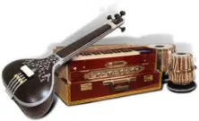
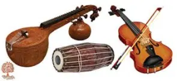
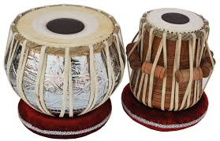
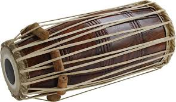

**Tabla is a Hindustani Musical Instrument. It is a Percussion Instrument.**

### Music
First, you have to know What **Music** is?

*Vocal, Instrument, Dance*. All these three together form a Music. Vocal is the Singing part, Instrument gives the flavor to the Song, and last the Dance is where they act according to the Song. This leads to the Music.

In India, we have two types of Music which are **Hindustani Shastreeya Sangeeth** (Hindustani) and **Karnataka Shastreeya Sangeeth** (Carnatic). These are Classical Music forms. *Hindustani Classical Music* is from the North part of India and *Carnatic Classical Music* is from the South part of India. These forms they have the same 7 swaras (Sa-Shadjam, Re-Rishabham, Ga-Gandharam, Ma-Madyamam, Pa-Panchamam, Da-Daiwatham, Ni-Nishadham). The basic difference between these is in the form of compositions and the concert setup. *Hindustani* compositions are Khayal, Dhrupad, Tarana, Thumri, Dhamaar, and concert setup is Singer supported by Harmonium, Tabla, etc. *Carnatic* compositions are Varnam, Kriti, Tillana, Javalis etc. and concert setup is Singer supported by Violin, Mridangam, etc. You can know more about Indian Classical Music form [this](https://en.wikipedia.org/wiki/Indian_classical_music) link.

*Above pictures Left: Hindustani Music, Right: Carnatic Music*

### Musical Instrument

It is an Instrument which produces different sounds. Instruments are used to support the singer while singing. Instrumentalists use these instruments and produce a sound which suits the context of the song. This gives feel to the song.

You might have a doubt that what percussion is? Instruments are divided again into *Percussion* and *Non-Percussion* Instruments. All the Drum Instruments (sounded by being struck, scraped or rubbed by hand) come under Percussion. And other Instruments come under Non-Percussion Instruments.

Where there is Music there are Instruments also. So, here there are both Hindustani and Carnatic Instruments. These instruments are designed according to their respective Music. In the Hindustani Music, one of the Instrument is **Tabla**. As Tabla is a Drum type Instrument it is a **Percussion Instrument**.

Tabla

Phakawaj

### Tabla

It it is a Hindustani Instrument which consists of two drums Bayan (Big Drum), Tabla (Small Drum). These two are hollow from inside. Bayan is made of Metal and Tabla is made of Wood. The top layer is made of Leather. Bayan is Low pitched and Tabla is High pitched. There is a Hammer which is used for tuning Tabla. Tabla is played using two Hands with different finger moments (both or either of hands). Tabla is originated from **Phakawaj** which is also a Hindustani Musical Instrument. Tabla was invented by *Ustad Amir Khusro* during the 13th Century. Once When Ustad Amir Khusro asked his students to bring his Phakawaj to the Royal Court to play in front of the King his students on the way accidentally broke it. Then Ustad Amir Khusro played on the same with which came a beautiful sound. From then it was called टूटा तो बोला which means “Spoke even Broken”. From then it is now called **Tabla**.
