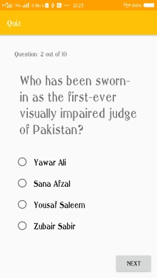

### About KWoC

First, you might think what KWoC is. It is **Kharagpur Winter of Code**. It is a 5-week long online programme for the open source developers conducted by open source club at IIT-Kharagpur. This could be helpful for who would participate in **Google Summer of Code** **(GSoC)**.

<!--truncate-->

You can know more about KWoC from [here][kwoc].

### How I got to know about KWoC

I got to know about this programme from my seniors. They advised me to apply as a mentor as I already have a working project in my GitHub. I went to the KWoC website and registered as a mentor to the project. I didn’t even hope for getting selected for that. Then, at last, got selected into the programme as mentor.

### My Project

[This][project] is GitHub link of the project. You can go through it.

My project is an Android application named **Quiz**. This uses [Open-Trivia][open-trivia] to get questions.

### Experience I had

I felt excited when I got to know that I was selected for the programme. Then I started creating Issues for the application. And people who I don’t know approached me through gitter channel asking for how to start to contribute. I gave a briefing on how to start to contribute. When the Coding Period began the people started looking at the issues and started sending PR’s for the project. First, when I received PR I looked into the code and reviewed that and felt happy to merge that. By receiving some amount of PR’s I felt people liked my project.

I learned many things through this. The first how to respond to others. I felt different in saying no to the person who asked they would work on it while other is already working but got habituated to that. I sometimes felt difficult in reviewing the PR’s so created a Pull Request Template as I could find it easy to look into it.

As I included Travis-CI, Mergeable to the project I felt it helped. I didn’t even look the code if it didn’t pass these Tests. This made easy for me on reviewing. I felt it would be more easy for me by adding Contributing file also to the project.

### What I learned from it

As a **Mentor**, Make sure to have all the files like Description, ReadMe, Contribute, Code of Conduct, License, Pull Request Template, Issue Template. It will not only be useful for the people who contribute to the project but also mentors in reviewing. Merge only PR’s which the project requires. Feel free to communicate with the developers.

Assuming as a **Student**, after selecting a project first need to go through the ReadMe and Contribution file then look through the issues in the project and select one which feels good. After this, check if there is someone already working on it and ask whether to work if feel they are not working. Then while working let the commit messages be reasonable. Then before sending the PR, make sure the unnecessary commit messages are squashed and the PR is sent to the branch meant to receive PR’s. Then send a PR based on how the PR template is and wait for the review. After the review is done if any changes suggested, change that and send PR again else it will get merged.

What I want to tell is Don’t feel bad because your PR is not merged. “PR not merged doesn’t mean you are not good at developing, it means that is not the right thing which is needed for the project”.

### Evolution of the Application

*Above pictures Left: Before, Right: After*

### Statistics

*PR’s received:* 31

*PR’s Merged:* 21

*Total Lines Added:* 1788

*Total Lines Removed:* 1264

*Total Commits:* 32

At last, I thank KWoC in helping me to get the knowledge in Open Source.

[kwoc]:         https://kwoc.kossiitkgp.org/
[project]:      https://github.com/immadisairaj/Quiz
[open-trivia]:  https://opentdb.com/