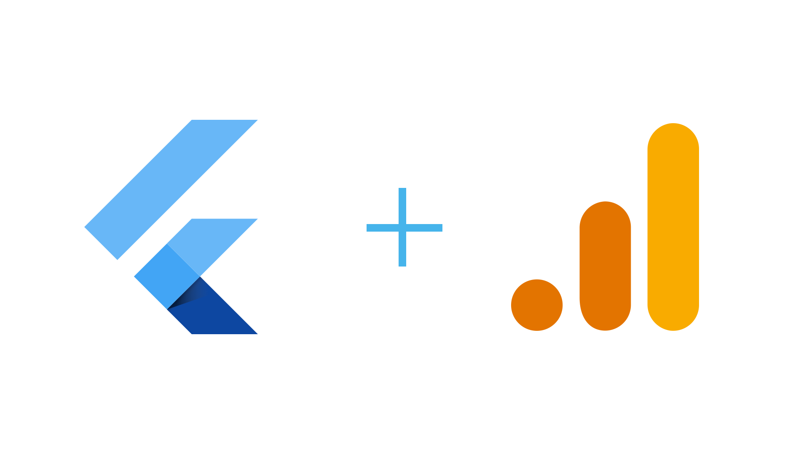

Want to add Google Analytics to your flutter web application? Then, this blog is for you.

I didn't find any direct methods to add google-analytics to my flutter-web application while I was searching. I've managed to integrate it successfully by referring to different blogs. So, I am writing this blog to make it easier.



## Steps to be followed

### Create Google Analytics

Go to [analytics.google.com][analytics] and login with your account. Then, create a new property with your website domain linked. Now, go to `Admin -> Property -> Tracking Info -> Tracking Code` and keep the *Tracking ID* noted. (It looks something like `UA-XXXXXXXXX-X`)

### Add Google Analytics to Flutter Project

So, assuming you have already set-up the flutter-web project.

Create a new file named `app.js` under `/web`. And the copy the below code into it.

*Old:*
```javascript
// Warning: Old method, please prefer the new script (below)
// file: /web/app.js
function sendNavigation(location) {
    ga('send', 'pageview', location);
}
```

*New:*
```javascript
// file: /web/app.js
function sendNavigation(location) {
    // Replace UA-XXXXXXXXX-X with Google Analytics ID
    gtag('config', 'UA-XXXXXXXXX-X', { page_path: location });
}
```

You might already have a file `/web/index.html`. Add the following into the *html* file inside `<head>` and `</head>`.

*Old:*
```html
<!-- Warning: Old method, please prefer the new script (below) -->
<!-- file: /web/index.html -->
<head>
    <!-- ... -->
    <script>
        (function(i,s,o,g,r,a,m){i['GoogleAnalyticsObject']=r;i[r]=i[r]||function(){
        (i[r].q=i[r].q||[]).push(arguments)},i[r].l=1*new Date();a=s.createElement(o),
        m=s.getElementsByTagName(o)[0];a.async=1;a.src=g;m.parentNode.insertBefore(a,m)
        })(window,document,'script','https://www.google-analytics.com/analytics.js','ga');

        // Replace UA-XXXXXXXXX-X with Google Analytics ID
        ga('create', 'UA-XXXXXXXXX-X', 'auto');
        ga('send', 'pageview');
    </script>
    <!-- ... -->
    <script src="app.js" defer></script>
</head>
```

*New:*
```html
<!-- file: /web/index.html -->
<head>
    <!-- ... -->
    <!-- Replace UA-XXXXXXXXX-X with Google Analytics ID -->
    <script async src="https://www.googletagmanager.com/gtag/js?id=UA-XXXXXXXXX-X"></script>
    <script>
      window.dataLayer = window.dataLayer || [];
      function gtag(){dataLayer.push(arguments);}
      gtag('js', new Date());

      // Replace UA-XXXXXXXXX-X with Google Analytics ID
      gtag('config', 'UA-XXXXXXXXX-X', { send_page_view: false });
    </script>
    <!-- ... -->
    <script src="app.js" defer></script>
</head>
```

After adding this, you can have the Google-Analytics running. But, there is a small error you might face and which is, the whole website which has different pages be tracked under the same page `/` and it is because the whole flutter web project is being built on the root. So, the navigation pages would have something like `/#/<route>`. So, the Google-Analytics doesn't track those pages due to `#` coming in between. But, fear not, I might just have a fix for it.

I am assuming that you are using named navigation to navigate different pages.

The following might be the code you are already having. and I have few comments there to just add what all lines are needed.
```dart
// example file: /lib/home.dart

import 'package:flutter/material.dart';
import 'dart:js' as js;     // add this line if you don't have one

class Home extends StatelessWidget {
  const Home({Key key}) : super(key: key);

  static const String route = '/'; // add this line if you don't have one
  
  @override
  Widget build(BuildContext context) {
    js.context.callMethod('sendNavigation', [route]);   // add this line
    return Scaffold(/* ... */);
  }
}
```
The above code is an example for Home page. If you want to track other pages, have the same code added to the other pages as well. Now, you will be having all your pages tracking in Google-Analytics.

**Note:** You need to look that all the pages tracked, but this tracking will not contain `#` in them. For example, `/#/<route>` will be tracked as `/<route>`.

If you want to look into an example of how I integrated Google-Analytics into my Flutter Web Application. [Here][commit] is the commit of the google-analytics integration.

[analytics]: https://analytics.google.com
[commit]: https://github.com/immadisairaj/CarouselPortfolio/commit/51f4e0b918a6965083e6ad687e46d27bf2326336
