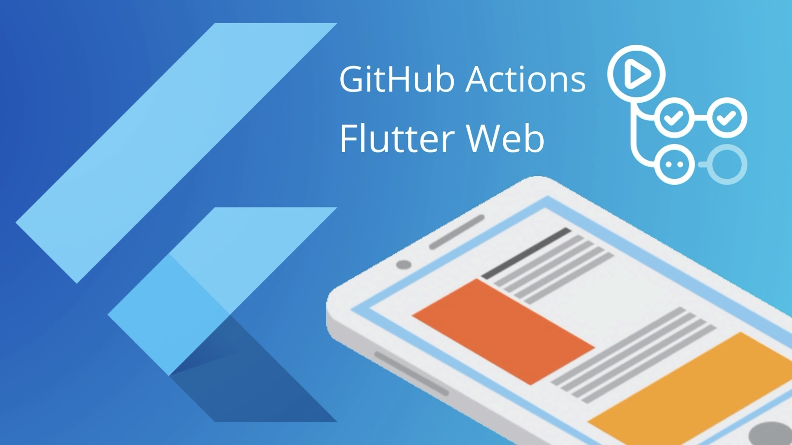
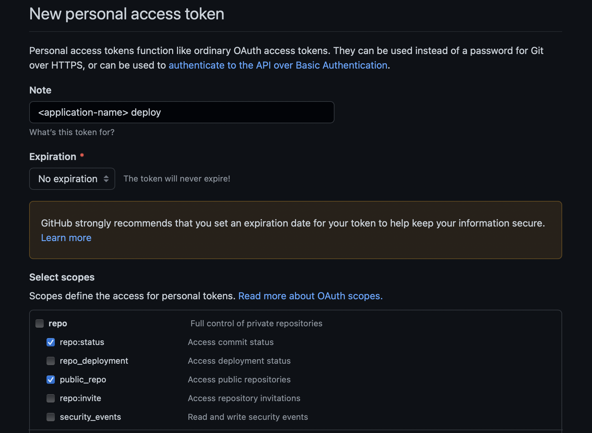

Do you deploy your Flutter web application in gh-pages? And you are tired of manually deploying the app every time? Or do you want to deploy your Flutter web application to gh-pages? Then this blog is for you. Continue ahead to know how to simplify the process.



<!--truncate-->

## What are GitHub Actions?

In a simplified manner, Actions are scripts automated to do something after they are on GitHub.

Officially from what GitHub says, GitHub Actions makes it easy to automate all your software workflows, now with world-class CI/CD. Build, test, and deploy your code right from GitHub. Make code reviews, branch management, and issue triaging work the way you want. You can read more about it [here][github-actions].

## What are GitHub Pages?

In simple terms, they are static web pages hosted on GitHub via repositories. They are static, which means we won't be able to get any data that is dynamic. You can read more about it [here][github-pages].

If you are the one that wants to host static web pages, you can continue. Else, I don't want to waste your time.

## What are we going to do?

Okay, I will get to the point. If you are a Flutter developer, have a static web page built, and want to deploy it. That is where I come in to help you. I make things simpler by deploying your web app to gh-pages with ease.

__Let's first look at how the following goes:__
1. Getting Your Personal Access Token from GitHub
2. Adding the Token to GitHub Actions secrets
3. Writing GitHub Actions workflow to deploy

### Getting Your Personal Access Token from GitHub

Why is this necessary? It is because we build the web app behind the hood and then push the commit to deploy into gh-pages with your GitHub credentials.

If you worry that this method might compromise your security, Don't worry, this method won't harm you an inch because we won't be giving full access to it.

To start, first click [this][new-pat-token] link to generate a new GitHub Personal Access Token.



*options to give while creating a Personal Access Token*

You can set the checkboxes as per the above image. The name can be your custom name, and the duration limit you give is up to your use case.

Once done here, scroll down and click on "Generate Token".

After the token is generated, NOTE it down somewhere to be used in the next phase. Let's call this token `<YOUR GENERATED PA TOKEN>`.

### Adding the Token to GitHub Actions secrets

Assuming that you already have the code for the web application in the GitHub repository, I will continue with this phase. If you don't have a GitHub repository, you continue once you have one.

You can visit the settings of the project repository to add the token you received before into secrets. You can use the following link.

```
https://github.com/<username>/<repository>/settings/secrets/actions/new
```

*Make sure to replace `<username>` with your GitHub username and `<repository>` with the repository.


*add the Personal Access Token into GitHub Actions secrets*

Once you see the screen (from the image), you can add your Personal Access Token generated from the previous phase `<YOUR GENERATED PA TOKEN>` with the name `ACCESS_TOKEN` as in the image.

Now that we have added the token into GitHub Action secrets, it is safe, and you can delete/remove the previously noted so that it is not known to anyone. And now, we can move on to the next phase.

### Writing GitHub Actions workflow to deploy

Assuming you have a basic understanding of how to set up a new branch to deploy a web app into GitHub Pages. Else, you can read it [here][deploy-to-gh-pages].

If you don't have a separate branch used for deploying, please do create a new branch (preferred `gh-pages`).

Once you have a specific branch name (say `gh-pages`) that uses to deploy into GitHub Pages, you can create a file name `web-deploy.yml` under `.github/workflows` in the root folder of `main` or `master` (or your preference) branch.

You can now copy the below directly into the file specified above while making a few changes.

You can look at comments starting with `#!` in the following to make changes accordingly.

<!-- <script async defer src="https://gist.github.com/immadisairaj/69a2942b68ef19f078c3e864ee3c41fe.js"></script> -->

```dart title=".github/workflows/web_deploy.yml"
name: Deploy to GitHub Pages

on:
  push:
    # Update branch according from where you will be pushing the code
    branches: [ main ]

jobs:
  build:
    runs-on: ubuntu-latest
    env:
      my_secret: ${{secrets.ACCESS_TOKEN}}

    steps:
      - uses: actions/checkout@v3
      - uses: subosito/flutter-action@v2
        with:
          channel: 'stable'

      - run: flutter clean
      - run: flutter pub get
      - run: flutter build web --release

      # Web deploy now is contained in build/web directory
      - run: |
          cd build
          mkdir web-deploy
          cd web-deploy
          #! Update with your Email ID associated with GitHub
          git config --global user.email <email ID>
          #! Update with your username associated with GitHub
          git config --global user.name <username>
          git config --global init.defaultBranch main
          git init
          # the repository to push the deploy into
          #! Update the following with your username and repository
          git remote add origin https://${{secrets.ACCESS_TOKEN}}@github.com/<username>/<repository>.git
          git fetch origin gh-pages
          git switch gh-pages
          # copy the build that is there in ROOT/build/web into ROOT/build/web-deploy
          cp -R ../web/* .
          git status
          git add .
          # add commit of the previous commit from main
          echo ""
          echo "Committing to gh-pages: ${{ github.event.head_commit.message }}"
          echo ""
          git commit -m "${{ github.event.head_commit.message }}"
          git push origin gh-pages
          
```

Once done adding it, commit it to the main branch. From this point on, you don't need to manually push the build to the deployment after having new changes.

### Bonus

You can continue with the bonus if you want to understand what the above action or script is doing. Else you can skip this.

Once you push the commit into GitHub Repository (say `main` branch), the GitHub Action is triggered (following steps).
- Installs flutter in the ubuntu-latest system.
- Builds flutter web into `/build/web`.
- Pull the `gh-pages` branch from the repository into `/build/web-deploy`.
- Copy the build from `/build/web` to `/build/web-deploy`.
- Commit the change with the commit message that triggered this action.
- Push the new commit to `gh-pages` branch into the repository (for which the personal access token is useful). This push, in turn, starts another GitHub Action to deploy the site.

## Conclusion

After this long 3 step process, you have now automated the process to deploy your Flutter web into GitHub Pages. Once you push a new commit, this GitHub Action starts and a new commit for you to deploy GitHub Pages.

Now, use the time I saved into something helpful and Happy Fluttering!


If this has been useful, please consider sponsoring me via
<iframe src="https://github.com/sponsors/immadisairaj/card" title="Sponsor immadisairaj" height="200" width="600"></iframe>

[github-actions]: https://github.com/features/actions
[github-pages]: https://pages.github.com
[new-pat-token]: https://github.com/settings/tokens/new
[deploy-to-gh-pages]: https://docs.github.com/en/pages/getting-started-with-github-pages/creating-a-github-pages-site
