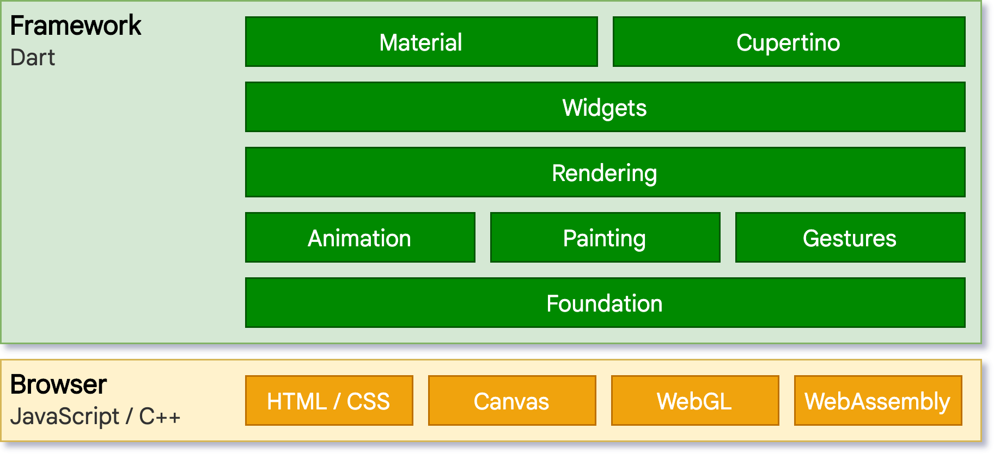

Are you always confused why your Flutter app on the web gives out some lags, errors or sometimes with even no proper colors on images? Think no further to read this blog to learn everything about Flutter Web that can help you solve your problems or understand Flutter Web better for your new/existing web application.


<!--truncate-->

## Renderer

A renderer is something under the hood that a framework does (flutter here) to render the web application. In Flutter 3.10 (stable channel), the dart code is compiled to js using [dart2js][dart2js] so a web browser can interpret it. 

I won't go deep into how rendering works, but here is a small story you need to know. Flutter engine, written in C++, web doesn't have access to the underlying engine, unlike mobile and desktop. With this, Fluter needed a different approach to render on the web. With the need for a different approach, Flutter had to reimplement the engine on top of browser-specific API only for the web.

### Types of renderers

The first approach for Flutter was to use HTML elements, CSS and [Canvas API][canvas-api]. Here the Flutter engine creates HTML elements and then puts out the styling and arrangement using the Canvas API. This renderer is named **HTML**.

The second approach for Flutter is to bring the [SKIA][skia] (graphics engine) compiled to Web Assembly using the [Canvas Kit][canvas-kit-api]. Here the Flutter engine creates Canvas elements and uses the Canvas Kit API to style the canvas. This method brings more control and flexibility as the Flutter engine uses SKIA (slowly moving to Impeller on mobile) to render. This renderer is named **CanvasKit**.

<figure>


<figcaption style={{textAlign: 'center', fontStyle: 'italic', color: '#828282'}}>Flutter web architectural layer</figcaption>

</figure>

### Development

Flutter is known for its [hot reload][hot-reload] feature. But, with the different approach needed for Flutter Web, we don't get to experience this feature. So, to solve this, Flutter uses [dartdevc][dartdevc] that supports an incremental compilation during the development process and supports hot restart (not hot reload). It uses the [dart2js][dart2js] when creating production apps.

## Use Renderer

You can use the `--web-renderer` command line option:
- auto (default)
- html
- canvaskit

By default, Flutter uses auto (no need to specify anything). It uses the _html_ renderer on mobile and _canvaskit_ renderer on desktop browsers.

Example usage for the run or build subcommands:
```bash
flutter run -d chrome --web-renderer html
```
```bash
flutter build web --web-renderer canvaskit
```

There is also an option to override the renderer at run-time.
```html title="web/index.html"
<body>
  <script>
    let useHtml = true;

    window.addEventListener('load', function(ev) {
    _flutter.loader.loadEntrypoint({
      serviceWorker: {
        serviceWorkerVersion: serviceWorkerVersion,
      },
      onEntrypointLoaded: function(engineInitializer) {
        // Run-time engine configuration
        let config = {
          renderer: useHtml ? "html" : "canvaskit",
        };
        engineInitializer.initializeEngine(config).then(function(appRunner) {
          appRunner.runApp();
        });
      }
    });
  });
  </script>
</body>
```
To learn more about the usage of renderers, visit [Flutter docs][flutter-web-run].

## Pros and Cons

Everything has advantages and disadvantages. Let us look at what they are in different renderers.

### HTML renderer

This renderer uses a combination of HTML Elements, CSS, Canvas Elements & SVG Elements to render the web page. It is pretty straightforward (as mentioned above) in how it lays the components.

**+'s:**
- Have a lesser bundle size
- Faster initialization
- Use native text rendering

**-'s:**
- Problematic SVG support
- Few Canvas APIs don't work properly

### CanvasKit renderer

This renderer (as mentioned above) uses CanvasKit to render the web page. CanvasKit uses [WebGL][webgl], a graphics API, to execute SKIA paint commands. It is on par with the Flutter mobile and desktop applications.

**+'s:**
- Faster performance
- Higher widget density
- Browser independent

**-'s:**
- Adds 1.5MB of bundle size
- Doesn't use native text rendering
- CORS issues

## In Detail

We've learnt about the renderers in general. Now, it's time to dive into various topics related to renderers.

### Simple Rendering

Let us consider a sample code that consists of only texts to look at the difference in the rendering and their elements.

```dart title="Example code for simple rendering."
Column(
    children: const [
        Text('This is center aligned'),
        Align(
            alignment: Alignment.topLeft,
            child: Text('This is left aligned'),
        ),
        Align(
            alignment: Alignment.topRight,
            child: Text('This is right aligned'),
        ),
        Padding(
            padding: EdgeInsets.only(left: 10),
            child: Text('This is center +10 aligned'),
        ),
        Padding(
            padding: EdgeInsets.only(right: 10),
            child: Text('This is center -10 aligned'),
        ),
    ],
),
```

Output for the above code would be this (below image) for any renderer:


But we will find the actual difference when inspecting the page. It is as follows:

<figure>


<figcaption style={{textAlign: 'center', fontStyle: 'italic', color: '#828282'}}>Simple rendering inspect - html</figcaption>
</figure>

<figure>

<figcaption style={{textAlign: 'center', fontStyle: 'italic', color: '#828282'}}>Simple rendering inspect - canvaskit</figcaption>
</figure>

Looking at the HTML elements from both renderers, it is clear that the HTML renderer uses different HTML and Canvas elements to render the widgets, while the CanvasKit renderer uses only one Canvas element and paints the page using APIs. This technique makes the CanvasKit renderer perform better, be consistent with mobile and desktop and make it browser independent (as it just paints and does not depend on browser compatibility of elements).

CanvasKit, to be able to use the CanvasAPI and WebGL, has to ship a bit more files than HTML, which makes the web built using HTML renderer load faster. The difference in default download size is 1.5MB more in CanvasKit render. It was 2MB before, which tells us that the Flutter team is working hard on improving things daily.

Wow!! With just one section, we covered most of the pros and cons of both renderers. Let's learn about the remaining things left.

### Native Text Rendering

I used this term above, mentioning it is an advantage in HTML rendering and a disadvantage in CanvasKit rendering. To experiment on this, let us consider an example:

```dart title="Example code for native text rendering."
Center(
    child: Text('Using Emoji - 🫨'),
),
```

Time to render this sample code in both renderers, starting with the HTML renderer.

<figure>

<figcaption style={{textAlign: 'center', fontStyle: 'italic', color: '#828282'}}>Native text rendering - html renderer output</figcaption>
</figure>

There is no problem here, and the output is as expected. So, why bother? Let's look at how the CanvasKit renderer renders for the answer.

<figure>

<figcaption style={{textAlign: 'center', fontStyle: 'italic', color: '#828282'}}>Native text rendering - canvaskit renderer output</figcaption>
</figure>

Why did we go back in time (black and white emoji)? You might now start to think "native text rendering" definitely is a disadvantage in the CanvasKit renderer. But why and how?

Let us look back on what we learned about how HTML renders. It uses HTML elements, including the text. It makes the text access the default browser/platform-supported fonts. This process of using native fonts is what we call "Native Text Rendering". But why does the CanvasKit renderer not able to access native fonts? Again, when you look back on how CanvasKit renders the page. It has only one Canvas element and paints appropriately using the APIs. The bundle in CanvasKit doesn't know the fonts (emojis included), painting only in black and white.

#### Solution 1

With the new Flutter 3.10, there is a solution to solve this by using Color Emoji with configuring the Flutter engine.

```js title="web/index.html"
let config = {
    // uses Color Emoji font
    useColorEmoji: true,
};
engineInitializer.initializeEngine(config);
```

The output after this change when using the CnavasKit renderer for this would be as below:
<figure>

<figcaption style={{textAlign: 'center', fontStyle: 'italic', color: '#828282'}}>Native text rendering with useColorEmoji - canvaskit renderer output</figcaption>
</figure>

Well, I could say it didn't solve my problem. As you can see in the output from the HTML renderer, it uses the emoji from Apple. But, this solution only gave me the Google Color Emoji font.

#### Solution 2

With the limitation in the previous solution, there is a new page for another solution. It is to ship the font in addition to the already existing bundle. But remember, this solution increases the download size (apart from the 1.5MB).

Add the font file as an asset to your project, say `fonts/AppleColorEmoji.ttf`. Then add it to your `pubspec.yaml` file:
```yaml title="pubspec.yaml"
flutter:
    fonts:
    - family: AppleColorEmoji
      fonts:
        - asset: fonts/AppleColorEmoji.ttf
```

Now change the code to of your `Text` widget to include the font:
```dart title="Upgraded example code for native text rendering."
Center(
    child: Text(
        'Using Emoji - 🫨',
        style: TextStyle(fontFamily: 'AppleColorEmoji'),
    ),
),
```

Now looking at the output after the change to include the font file directly into the bundle, we get the desired result with the CanvasKit renderer.
<figure>

<figcaption style={{textAlign: 'center', fontStyle: 'italic', color: '#828282'}}>Native text rendering with font file - canvaskit renderer output</figcaption>
</figure>

:::tip

You could use the `RichText` (or `Text.rich`) and `TextSpan` widgets to use different fonts in the same sentence.

:::

Phew! That was a very bumpy ride. It is a widely known issue in the Flutter community for no reason. To learn more on this issue, visit [here][emoji-issue].

### Problematic SVG support

We know there won't be any more problems with the CanvasKit renderer. The problem here is with the HTML renderer. Considering a simple example displaying an [SVG image](./Firefox.svg):
```dart title="Example for svg image."
SvgPicture.asset('assets/Firefox.svg'),
```

:::note

`SvgPicture` is a widget from the [flutter_svg][flutter-svg] package.

:::

Comparing the result from both renderers:
<figure style={{display: 'flex', alignItems: 'center', justifyContent: 'center'}}>
<figure style={{display: 'flex', flexDirection: 'column', alignItems: 'center'}}>

<figcaption style={{textAlign: 'center', fontStyle: 'italic', color: '#828282'}}>Firefox SVG - html</figcaption>
</figure>
<figure style={{display: 'flex', flexDirection: 'column', alignItems: 'center'}}>

<figcaption style={{textAlign: 'center', fontStyle: 'italic', color: '#828282'}}>Firefox SVG - canvaskit</figcaption>
</figure>
</figure>

Our assumption about the result from both renderers is True. Here in this example, the gradient color in the HTML renderer is different due to some problems with the SVG support in the HTML renderer. This current problem is with the two-point canonical gradient not being supported.

To learn more about this problem and other problems with HTML rendering, start with [this][svg-canonical-issue] issue.

### Canvas API limitations

Unlike the previous problems with SVG support in HTML renderer, this is another issue with a limitation from using [`Canvas.saveLayer`][save-layer-method]. It closes the door for different uses, like blending colours, etc.

I will show you a simple example of how it affects blending in [this image](./flutter_logo.svg). For more information, visit the [Flutter issue][save-layer-issue].

```dart title="Example of color blending with SVG."
SvgPicture.asset(
    'assets/flutter_logo.svg',
    colorFilter: const ColorFilter.mode(Colors.blue, BlendMode.difference),
),
```

Output for these would be:
<figure style={{display: 'flex', alignItems: 'center', justifyContent: 'center'}}>
<figure style={{display: 'flex', flexDirection: 'column', alignItems: 'center'}}>

<figcaption style={{textAlign: 'center', fontStyle: 'italic', color: '#828282'}}>Flutter SVG blend - html</figcaption>
</figure>
<figure style={{display: 'flex', flexDirection: 'column', alignItems: 'center'}}>

<figcaption style={{textAlign: 'center', fontStyle: 'italic', color: '#828282'}}>Flutter SVG blend - canvaskit</figcaption>
</figure>
</figure>

Now that we are in the concept of Images. Let us look at what they are in Flutter web.

### Images in Flutter Web

On the web, Flutter uses three different methods to display images:
- [``][img-element] and [`<picture>`][picture-element] - built-in HTML elements
    - Has browser caching, image optimization and memory management
- [`drawImage`][draw-image-method] on [`<canvas>`][canvas-element] - Canvas element
    - Able to size images and read pixels for further processing
- A custom codec that renders to WebGL canvas
    - Can apply custom algorithms to pixels, use GLSL (shaders)

The HTML renderer uses the first two, and the CanvasKit uses the third method from the above three methods.

Because of the usage of the `` element by the HTML renderer, it can display images from arbitrary sources. It places some restrictions on what a renderer can do with the Image. Learn more about those limitations from [Flutter docs][html-image-limitations].

CanvasKit, to apply custom image manipulation, need full access to the pixels of the Images. To do so, it is subject to CORS policy.

### Cross-Origin Resource Sharing (CORS)

[CORS][cors] is a mechanism that allows a server to indicate any origins other than its own from which a browser should permit loading resources.

When getting images from different sources (arbitrary sources) into the elements ``, `<picture>` and `<canvas>`, the browser automatically blocks access to the pixel data, and the CORS policy disallows the data. So, the HTML renderer doesn't have issues with the CORS policy apart from a few limitations.

CanvasKit renderer needs access to pixels to paint them. So, it needs images to follow CORS policy. And which don't follow the CORS policy (from an arbitrary source) are not displayed on the web page.

Let us look at it in action:
```dart title="Example for CORS policy."
Image.network('https://somesite.com/someimage.jpg'),
```

Output:
<figure style={{display: 'flex', flexDirection: 'column', alignItems: 'center'}}>

<figcaption style={{textAlign: 'center', fontStyle: 'italic', color: '#828282'}}>Arbitrary source image - html renderer</figcaption>
</figure>
<figure style={{display: 'flex', flexDirection: 'column', alignItems: 'center'}}>

<figcaption style={{textAlign: 'center', fontStyle: 'italic', color: '#828282'}}>Arbitrary source image - canvaskit renderer</figcaption>
</figure>

Seeing this, we learned that to use images from arbitrary sources with CanvasKit renderer following CORS policy is a must. Else, it would throw an error (like above).

What could you do to solve this issue if you want to use an image from an unknown source?

#### Solution

There are different methods to solve this issue:
- Make the Image an asset
    - It becomes the same-origin as the server following the CORS policy
- Host the Image in CORS-enabled CDN
    - Content delivery network - configure what domains can access the Image
- Use CORS Proxy
    - If there is no control of the Image server, use a proxy to load the Images

To view more in detail on how to use these solutions and how images work with Flutter web, you can go through the [Flutter docs][images-and-cors].

## What to Choose?

You have told us a lot!! Now, what renderer do I choose? The reason two renderers are present is for different use cases. So, it depends on what kind of application you are building. After reading this (if you have read it), you can easily decide what renderer you need.

To help you, I have curated a few points on when to use what.
<figure>

<figcaption style={{textAlign: 'center', fontStyle: 'italic', color: '#828282'}}>Classification on what flutter web renderer to choose</figcaption>
</figure>

## Future - WASM

The future of Flutter web is getting the [WebAssembly (Wasm)][web-assembly] directly instead of going through the [dart2js][dart2js] (eliminating JavaScript). It would be `dart2wasm`.

The Flutter and Dart team are already working on compiling directly to Wasm instead of Js. And they are almost near getting it out to the public (stable release). With the [latest announcement of Dart 3][dart-3-release], the compatibility for Wasm is not so far. And we also get to experience the [first preview of Wasm][flutter-wasm] in the master channel of Flutter.

Flutter currently already uses Wasm in the stable channel. Not compiling dart code to Wasm but instead converts the C++ code of CanvasKit (SKIA) to Wasm.

As of today (the time of writing this blog), the Build time of the Flutter web with Wasm (master) is slower. But, we can see a smaller download size and faster web application (but with some limitations). You can view the preview app from the release [here][wasm-preview-app].

Learn more about Wasm in Flutter by visiting [here][flutter-wasm] and watching [this][wasm-video] video.

In short, it would be a big jump for Flutter on the web once the work with Wasm becomes stable. Performance, Size would be huge factors here.

## Conclusion

Flutter Web is a vast topic to discuss or ponder upon. There are topics like Fragment Shaders, Element Embedding and many other things. I only choose the concept of renderers as a start because I feel it is a fundamental basic concept that developers need before building web applications in Flutter. It is to provide the current problems/limitations with Flutter Web and to understand different topics related to renderers in Flutter that motivated me to write this blog.

***

If this has been useful, please consider sponsoring me via
<iframe src="https://github.com/sponsors/immadisairaj/card" title="Sponsor immadisairaj" height="200" width="600"></iframe>

<!-- Links -->
[dart2js]: https://dart.dev/tools/dart2js
[canvas-api]: https://developer.mozilla.org/en-US/docs/Web/API/Canvas_API
[skia]: https://skia.org
[canvas-kit-api]: https://skia.org/docs/user/modules/canvaskit/
[hot-reload]: https://docs.flutter.dev/tools/hot-reload
[dartdevc]: https://dart.dev/tools/dartdevc
[flutter-web-run]: https://docs.flutter.dev/platform-integration/web/renderers
[webgl]: https://www.khronos.org/webgl/
[emoji-issue]: https://github.com/flutter/flutter/issues/119536
[flutter-svg]: https://pub.dev/packages/flutter_svg
[svg-canonical-issue]: https://github.com/dnfield/flutter_svg/issues/491#issuecomment-790337290
[save-layer-method]: https://api.flutter.dev/flutter/dart-ui/Canvas/saveLayer.html
[save-layer-issue]: https://github.com/flutter/flutter/issues/48417
[img-element]: https://developer.mozilla.org/en-US/docs/Web/HTML/Element/img
[picture-element]: https://developer.mozilla.org/en-US/docs/Web/HTML/Element/picture
[draw-image-method]: https://developer.mozilla.org/en-US/docs/Web/API/CanvasRenderingContext2D/drawImage
[canvas-element]: https://developer.mozilla.org/en-US/docs/Web/HTML/Element/canvas
[html-image-limitations]: https://docs.flutter.dev/platform-integration/web/web-images#flutter-renderers-on-the-web
[cors]: https://developer.mozilla.org/en-US/docs/Web/HTTP/CORS
[images-and-cors]: https://docs.flutter.dev/platform-integration/web/web-images
[web-assembly]: https://webassembly.org/
[dart-3-release]: https://medium.com/dartlang/announcing-dart-3-53f065a10635
[flutter-wasm]: https://docs.flutter.dev/platform-integration/web/wasm
[wasm-preview-app]: https://flutterweb-wasm.web.app
[wasm-video]: https://youtu.be/Nkjc9r0WDNo 
